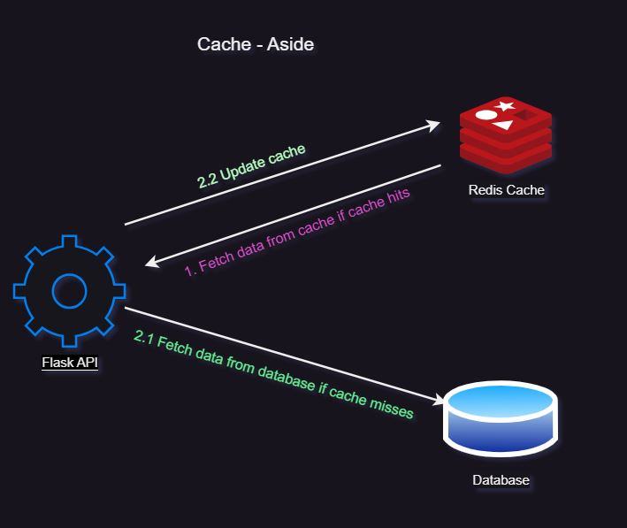
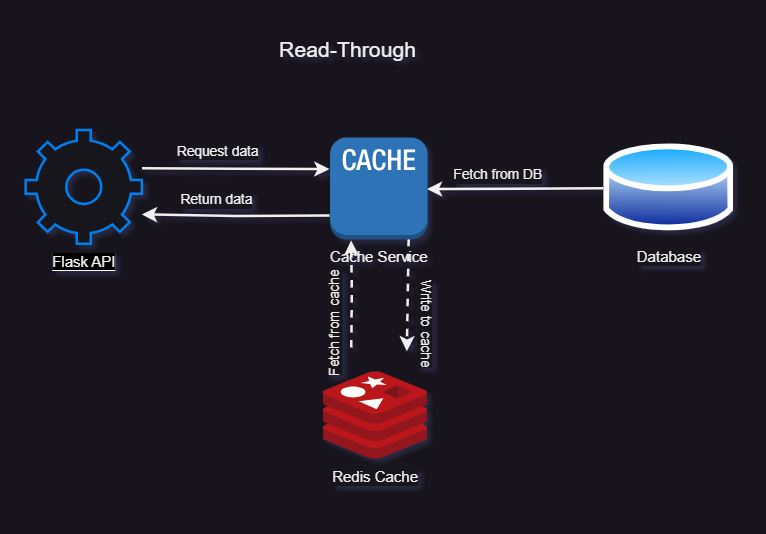
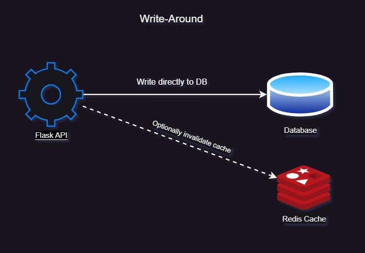

# db-caching-demo
A simple demo of different database caching strategies using Angular, Flask and Redis


## Local Setup

1. Redis cache

    Install and setup redis with data persistence enabled.

    Follow [installation guide](https://redis.io/docs/install/install-redis/)

    OR

    Use docker: 
    ```sh
    mkdir redis-data
    docker run -d --name my-redis -p 6379:6379 -v $(pwd)/redis-data:/data redis:latest --appendonly yes
    ```

    OR 

    Use free redis database in the cloud. Create a [free account](https://redis.com/try-free/).

    Optionally, install Redis Insight.

2. Create a virtual environment and install dependencies.

    ```sh
    python -m venv .venv
    . venv/bin/activate
    pip install -r requirements.txt
    ```

3. Start the application.

    ```sh
    python main.py
    ```


## Database Caching Strategies


### Cache-Aside



### Read-Through



### Write-Around

Using the write-around policy, data is written only to the backing store without writing to the cache. 
Good for not flooding the cache with data that may not subsequently be re-read.
Reading recently written data will result in a cache miss (and so a higher latency) because the data can only be read from the slower backing store.
The write-around policy is good for applications that don’t frequently re-read recently written data. This will result in lower write latency but higher read latency which is a acceptable trade-off for these scenarios.




## Cache Eviction Strategies

Least Recently Used (LRU)
Time to Live (TTL)