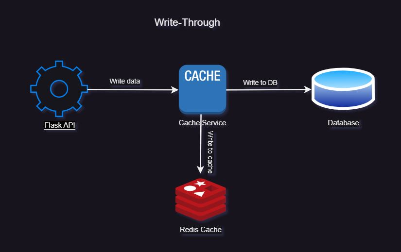

# db-caching-demo
A simple demo of different database caching strategies using Angular, Flask and Redis


## Local Setup

1. Redis cache

    Install and setup redis with data persistence enabled.

    Follow [installation guide](https://redis.io/docs/install/install-redis/)

    OR

    Use docker: 
    ```sh
    mkdir redis-data
    docker run -d --name my-redis -p 6379:6379 -v $(pwd)/redis-data:/data redis:latest --appendonly yes
    ```

    OR 

    Use free redis database in the cloud. Create a [free account](https://redis.com/try-free/).

    Optionally, install Redis Insight.

2. Create a virtual environment and install dependencies.

    ```sh
    python -m venv .venv
    . venv/bin/activate
    pip install -r requirements.txt
    ```

3. Start the application.

    ```sh
    python main.py
    ```


## Database Caching Strategies


### Cache-Aside (Lazy-Loading)


### Read-Through


### Write-Around

Using the write-around policy, data is written only to the backing store without writing to the cache. 

Good for not flooding the cache with data that may not subsequently be re-read.

Reading recently written data will result in a cache miss (and so a higher latency) because the data can only be read from the slower backing store.

The write-around policy is good for applications that don’t frequently re-read recently written data. This will result in lower write latency but higher read latency which is a acceptable trade-off for these scenarios.


### Write-Through

Using the write-through policy, data is written to the cache and the backing store location at the same time. The significance here is not the order in which it happens or whether it happens in parallel. The significance is that I/O completion is only confirmed once the data has been written to both places.

Ensures fast retrieval while making sure the data is in the database and is not lost in case the cache is disrupted.

Writing data will experience latency as you have to write to two places every time.

The write-through policy is good for applications that write and then re-read data frequently. This will result in slightly higher write latency but low read latency. So, it's ok to spend a bit longer writing once, but then benefit from reading frequently with low latency.




### Write-Back (Write-Behind)

Using the write-back policy, data is written to the cache and Then I/O completion is confirmed. The data is then typically also written to the backing store in the background but the completion confirmation is not blocked on that.

This method can greatly enhance performance for write-heavy applications because it reduces the number of write operations performed on the slower back-end storage. However, it introduces a risk of data loss if the cache data is not yet persisted and a system failure occurs.


## Cache Eviction Strategies

Least Recently Used (LRU)
Time to Live (TTL)